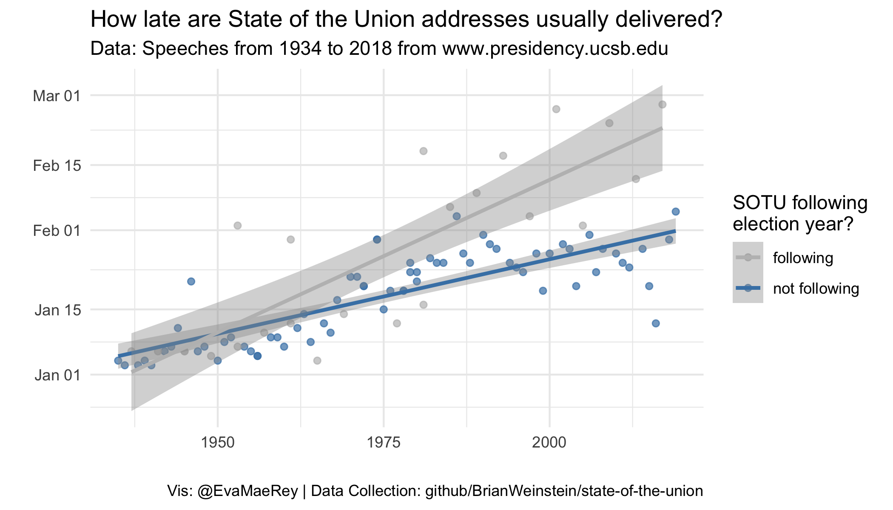

<!-- In your final paper you won't often want to echo code. Or see warning or messages on coding at this point.  So let's set the knitter setting to echo, warning and message to F globally -->

```{r, echo=FALSE}
knitr::opts_chunk$set(echo = F, warning = F, message = F)
```


# Abstract

State of the Union addresses are a classic corpus for students of text analysis.  To the author's knowledge, less has been done to characterize the timing of addresses.[^0]  In this paper you'll see time-in-year by year plots and a model of the timing.  

[^0]: Motivation for addressing this question actually comes from Kenneth Benoit who conducted a quick [analysis](https://twitter.com/kenbenoit/status/1088304778088566785) on this question.  


# Introduction

The 2019 government shutdown had many people wondering, when will US State of the Union address be delivered by the President.  Will it be pushed later than what is considered "normal".[^1] I might have another tangential comment.[^2] 

[^1]: Here is my tangential comment (footnote). It will appear at the end of the page or bottom of the document. 

[^2]: Here is a second tangential point.

# Literature Review

The texts of the State of the Union addresses have been studied by scholars including Benoit, Munger and Spirling [-@benoit2018measuring]; they offer an interesting analysis of State of the Union addresses by US presidents, noting that SOTU that are not delivered orally tend to use more complex language. There are several R text analysis packages [@silge2016tidytext; @benoit2016quanteda].   These entries are included in the literature/bibliography.bib document that is referenced in the YMAL.  

> In this section you might write quota a large selection which you will want to indent.


# Theory and Hypotheses

This analysis was exploratory.  It is well known that modern SOTU addresses are delivered early in the year.  After plotting the data, what seemed to matter was year of delivery, and if the SOTU followed an election year.  We tried to follow the advice in the e-book [The Fundamentals of Data Visualization](https://serialmentor.com/dataviz).

The principles in TFODV are listed in Table \@ref(tab:goodbadugly)  

Category | Description
-----|------
Bad  | Misrepresents data or confuse
Ugly | Not pleasing
Good | Not bad and not ugly

Table: (#tab:goodbadugly) This is the caption for the table about data visualization categories from *"The Fundamentals of Data Visualization."*


# Data 


The corpus data was made available by  on github.  
President in general give one SOTU address per year they serve as president but there are some exceptions as seen in table \@ref(tab:nice-tab) 


```{r nice-tab}
library(tidyverse)
# load cleaned data
load("data_products/sotu_texts.Rdata")
sotu_texts_mod <- sotu_texts %>% 
  mutate(president = fct_inorder(president)) %>% 
  group_by(president) %>% tally() %>% 
  rename(President = president) %>% 
  rename(`Number of Addresses` = n) 

knitr::kable(sotu_texts_mod %>% head(14), caption = "This table contains presidents and the number of SOTU that they have given")
```


# Analysis

## Visualization of relationships

Here I show some of the relationships in the data visually:

```{r year, fig.cap = "Timing of state of the union by year.  SOTUs that follow election years are colored with blue.", out.width='\\textwidth', fig.align='center'}
knitr::include_graphics("figures/sotu_timing_delivery.png")
```

In figure \@ref(fig:year) we use LOESS smoothing to summarize the relationship between year and time in year for the categories "following election year" and "not following".  In the linear modelling exercise below, we remove the 1973 cases, given that they are so unusual --- in light of the Nixon impeachment, there were multiple SOTU's delivered that year. 


## Modeling


<!-- If compiling to html: -->

We load the models that we've estimated and save out,then prepare the table using stargazer.

<!-- ```{r regtable_html, results = "asis"} -->
<!-- # load models that have been saved in .Rdata file previously -->
<!-- load("data_products/models.Rdata") -->
<!-- stargazer::stargazer(lateness_by_year, -->
<!--                      lateness_following_election, lateness_full, lateness_full_interaction, -->
<!--                      dep.var.labels = "Days elapsed since January 1st", -->
<!--                      covariate.labels = c("year", "post election", "year*post election"), -->
<!--                      title = "Models of time elapsed in year before state of the union address (#tab:regtable)", -->
<!--                      style = "qje", -->
<!--                      type = "html") -->
<!-- ``` -->


If compiling to pdf: in the ymal you will change: bookdown::pdf_document2.  Note that setting the label is done differently than the knit to html version.

```{r regtable_pdf,  results = "asis"}
load("data_products/models.Rdata")
stargazer::stargazer(lateness_by_year,
                     lateness_following_election, lateness_full_interaction,
                     dep.var.labels = "Days elapsed since January 1st",
                     covariate.labels = c("year", "post election", "year*post election"),
                     type = "latex", font.size = "small",
                     title  = "Models of time elapsed in year before state of the union address",
                     header = FALSE,
                     label = "tab:regtable"
                    )
# Todo figure out how to get stargazer message not to show
```


As you can see in the regression table \@ref(tab:regtable), the R^2 for the full model with an interaction term is `r round(summary(lateness_full_interaction)$r.squared, 3)`.


The full model formula with the interaction is:


$$ DaysSinceJan1 = \beta_0  + \beta_1Year + B_2FollowingElection + B_3Year*FollowingElection + \epsilon $$

```{r, fig.cap = "Timing of state of the union by year.  SOTUs that follow election years are colored with blue.",  out.width='\\textwidth', fig.align='center'}
# Include the figure that you have saved out in working files

```


Need to put figures side-by-side?  Use fig.show = hold in the code chunk options, and specify the width


```{r, fig.cap = "Timing of state of the union by year.  SOTUs that follow election years are colored with blue.",  out.width='45%', fig.align='center', fig.show= "hold"}
# Include the figure that you have saved out in working files
knitr::include_graphics(c("figures/sotu_timing_delivery.png", "figures/sotu_timing_model.png"))
```


Note that the visualization of the linear models do not represent the full model with the interaction but rather independent models for each category "following", "not following", the default for ggplot2.  Not going to worry about this.  


# Conclusion


The analysis shows the timing of State of the Union addresses is increasingly late in the year and is dependent on whether it follows an election year.  While the 2019 State of the Union address is in February, which is unusual for a large departure from the trend.  In future work, we might look at plotting prediction intervals as well as confidence intervals  Now is a good time to spell check (Edit -> Spell Check...)!   


# References 

<!-- The bibliography will automatically appear here if you cite some sources.  -->


