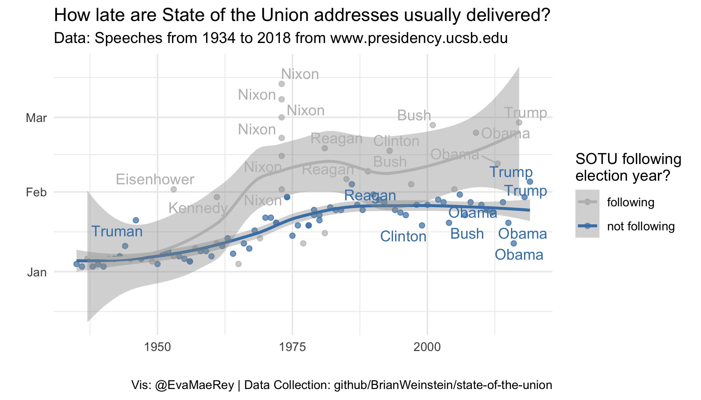

<!-- In your final paper you won't often want to echo code. Or see warning or messages on coding at this point.  So let's set the knitter setting to echo, warning and message to F globally -->

```{r setup, echo=FALSE, message=F, warning=F}
knitr::opts_chunk$set(echo = F, warning = F, message = F)
library(tidyverse)
```

Motivation {.block}
================================================================================


The State of the Union is an important summary of ...

It's delivery is most often in January, but with the 2019 government shutdown ...

Kenneth Bennoit raised the question about timing: 

> Far from unprecedented for a #stateoftheunion #SOTU address to be held in Feb or to be delivered written. 


Related Literature
================================================================================

Lorem ipsum dolor **sit amet**, consectetur adipiscing elit. Donec ut volutpat elit. Sed laoreet accumsan mattis. Integer sapien tellus, auctor ac blandit eget, sollicitudin vitae lorem. Praesent dictum tempor pulvinar. Suspendisse potenti. Sed tincidunt varius ipsum, et porta nulla suscipit et. Etiam congue bibendum felis, ac dictum augue cursus a. **Donec** magna eros, iaculis sit amet placerat quis, laoreet id est.


Category | Description
-----|------
Bad  | Misrepresents data or confuse
Ugly | Not pleasing
Good | Not bad and not ugly

Table: This is the caption for the table about data visualization categories from *"The Fundamentals of Data Visualization."*


```{r, gm-plot, fig.width=6, fig.height=3, dev='svg', out.width='100%', fig.cap='Figure Caption.', echo=FALSE}
gapminder::gapminder %>% filter(year == 2007) %>% 
  ggplot() +
  aes(gdpPercap, lifeExp) +
  geom_point() +
  theme_minimal()
  
```

Test citations @R-base @R-pagedown. See Figure \@ref(fig:gm-plot).


Theory 
================================================================================

The following materials were required to complete the research:


- Curabitur pellentesque dignissim
- Eu facilisis est tempus quis
- Duis porta consequat lorem
- Eu facilisis est tempus quis


The materials were prepared according to the steps outlined below:

1. Curabitur pellentesque dignissim
1. Eu facilisis est tempus quis
1. Duis porta consequat lorem
1. Curabitur pellentesque dignissim


Hypotheses
================================================================================

Lorem ipsum dolor **sit amet**, consectetur adipiscing elit. Sed laoreet accumsan mattis. Integer sapien tellus, auctor ac blandit eget, sollicitudin vitae lorem. Praesent dictum tempor pulvinar. Suspendisse potenti. Sed tincidunt varius ipsum, et porta nulla suscipit et. Etiam congue bibendum felis, ac dictum augue cursus a. **Donec** magna eros, iaculis sit amet placerat quis, laoreet id est. In ut orci purus, interdum ornare nibh. Pellentesque pulvinar, nibh ac malesuada accumsan, urna nunc convallis tortor, ac vehicula nulla tellus eget nulla. Nullam lectus tortor, _consequat tempor hendrerit_ quis, vestibulum in diam. Maecenas sed diam augue.


Important Result {.block}
================================================================================

It is rare for the State of the Union, when it does not fall in an election year, to be delivered as late as February.  However the addresses overall are getting later and later, and the 2019 address timing does not represent an outlying case. 


Data
================================================================================

::: {.figure-example}
```{r year, fig.cap = "Timing of state of the union by year.  SOTUs that follow election years are colored with blue.", fig.align='center'}
# Include the figure that you have saved out in working files

```

Figure 2: Figure caption.
:::

Nunc tempus venenatis facilisis. Curabitur suscipit consequat eros non porttitor. Sed a massa dolor, id ornare enim:


Model
================================================================================

```{r regtable, results = "asis"}
# load models that have been saved in .Rdata file previously
load("data_products/models.Rdata")
stargazer::stargazer(lateness_by_year,
                     lateness_following_election, lateness_full, lateness_full_interaction,
                     dep.var.labels = "Days elapsed since January 1st",
                     covariate.labels = c("year", "post election", "year*post election"),
                     title = "Predicting State of the Union Timing",
                     style = "qje",
                     omit.stat = "all",
                     type = "html")
```

<!-- Nam quis odio enim, in molestie libero. Vivamus cursus mi at nulla elementum sollicitudin. Nam quis odio enim, in molestie libero. Vivamus cursus mi at nulla elementum sollicitudin. -->

<!-- \begin{equation} -->
<!-- E = mc^{2} -->
<!-- (\#eq:Einstein) -->
<!-- \end{equation} -->

<!-- Nam quis odio enim, in molestie libero. Vivamus cursus mi at nulla elementum sollicitudin. Nam quis odio enim, in molestie libero. Vivamus cursus mi at nulla elementum sollicitudin. -->

<!-- \begin{equation} -->
<!-- \cos^3 \theta =\frac{1}{4}\cos\theta+\frac{3}{4}\cos 3\theta -->
<!-- (\#eq:refname) -->
<!-- \end{equation} -->

<!-- Nam quis odio enim, in molestie libero. Vivamus cursus mi at nulla elementum sollicitudin. Nam quis odio enim, in molestie libero. Vivamus cursus mi at nulla elementum sollicitudin. -->

<!-- \begin{equation} -->
<!-- \kappa =\frac{\xi}{E_{\mathrm{max}}} -->
<!-- \end{equation} -->

<!-- Nam quis odio enim, in molestie libero. Vivamus cursus mi at nulla elementum sollicitudin. Nam quis odio enim, in molestie libero. Vivamus cursus mi at nulla elementum sollicitudin. -->


Conclusions
================================================================================


::: {.figure-example}
```{r model, fig.cap = "Timing of state of the union by year", fig.align='center'}
# Include the figure that you have saved out in working files
knitr::include_graphics("figures/sotu_timing_model.png", dpi = 250)
```

:::


Key References
================================================================================

<div id="refs"></div>


```{r}
download.file("https://onedrive.live.com/view.aspx?resid=43EBDBC5D5265516!12284&ithint=file%2cxlsx&app=Excel&authkey=!AHoBkJE4yhL8sOI", "temp.xlsx")
```


Data sources {data-color=red}
================================================================================

Nam mollis tristique neque eu luctus. Suspendisse rutrum congue nisi sed convallis. Aenean id neque dolor. Pellentesque habitant morbi tristique senectus et netus et malesuada fames ac turpis egestas.


Nam mollis tristique neque eu luctus. Suspendisse rutrum congue nisi sed convallis. Aenean id neque dolor. Pellentesque habitant morbi tristique senectus et netus et malesuada fames ac turpis egestas.


